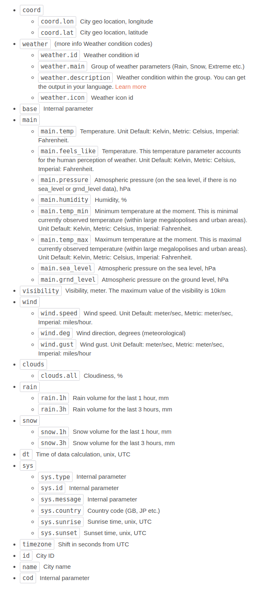

## Current Weather
### Api Call
`https://api.openweathermap.org/data/2.5/weather?lat={lat}&lon={lon}&appid={API key}`

`https://api.openweathermap.org/data/2.5/weather?q=${city}&units=${unit}&appid=${apiKey}`


```json
{
  "data": {
    "coord": {
      "lon": 7.0833,
      "lat": 51.1833
    },
    "weather": [
      {
        "id": 803,
        "main": "Clouds",
        "description": "broken clouds",
        "icon": "04d"
      }
    ],
    "base": "stations",
    "main": {
      "temp": 18.09,
      "feels_like": 17.1,
      "temp_min": 16.62,
      "temp_max": 20.03,
      "pressure": 1022,
      "humidity": 44,
      "sea_level": 1022,
      "grnd_level": 995
    },
    "visibility": 10000,
    "wind": {
      "speed": 5.12,
      "deg": 298,
      "gust": 6.99
    },
    "clouds": {
      "all": 64
    },
    "dt": 1655120147,
    "sys": {
      "country": "DE",
      "sunrise": 1655090165,
      "sunset": 1655149648
    },
    "timezone": 7200,
    "name": "Solingen",
    "cod": 200
  }
}
```

